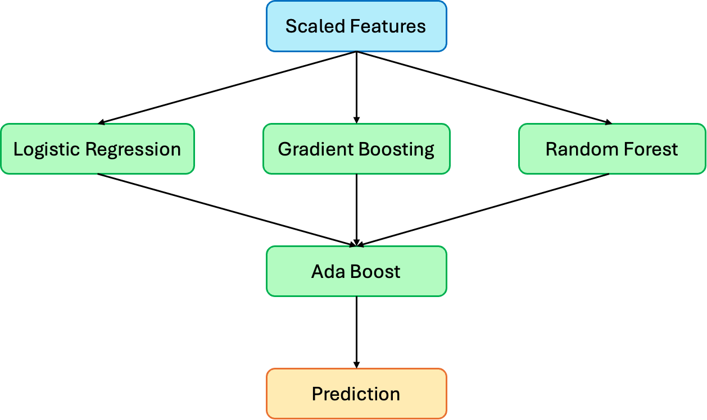

# Credit Card Fraud Detection

Ensamble learning model for detecting fraudulent credit card activities.

## Dataset

The dataset is taken from [Kaggle](https://www.kaggle.com/datasets/mlg-ulb/creditcardfraud), consisting of transactions from European cardholders in 2013. It is modified by doing Principal Component Analysis (PCA) on the original data.

This dataset presents transactions that occurred in two days, where we have 492 frauds out of 284,807 transactions. The dataset is highly unbalanced, the positive class (frauds) account for 0.172% of all transactions.

The data is split into training and test by a 80/20 ratio, resulting in 394 fraudulent cases being present in the training set and 98 in the test set. To keep the distribution of the data, all except the target feature was scaled using `StandardScaler`.

## Model

To solve this classification problem, the model is designed using ensemble learning. `LogisticRegression`, `GradientBoostingClassifier` and `RandomForestClassifier` are trained on the original data, passing their predictions into `AdaBoostClassifier`. This allows the Ada Boosting algoritm to learn the relation between the other predictions and the ground truth, providing significantly better results than using a simple model.

## Results

Below is the confusion matrix for the model's performance on the test set:
| Actual \ Predicted | Fraud | Not Fraud |
|--------------------|------:|----------:|
| Fraud              |    75 |        23 |
| Not Fraud          |     2 |     56861 |

This shows 75 fraudulent cases were correctly detected, while 23 cases werent detected. There were also 2 false positives. 97\% of the fraudulent cases are detected, but when the model classifies a transaction as fraudulent, it is only correct 77\% of the time. This results in a F1-score of 0.86.

For comparison, [this solution](https://www.kaggle.com/code/renjithmadhavan/credit-card-fraud-detection-using-python) achieved a f1-score 0.68, 21\% lower than the solution propsed here.